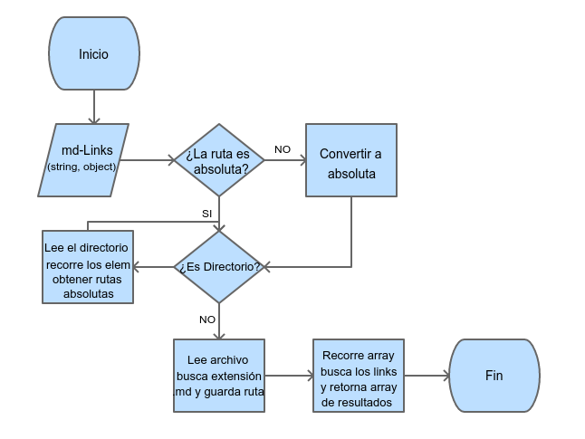

# Markdown Links

Librería desarrollada para extraer y analizar links, dentro de archivos con formato markdown.

## Versión

1.0.0

## Diagrama de Flujo

A continuación se presenta el diagrama que representa el algoritmo implementado para solucionar el problema.



## Instalación y Uso

- Instalar vía `npm install --global <github-user>/md-links`

## `mdLinks(path, options)`

### Argumentos

- `path`: Ruta absoluta o relativa al archivo o directorio.
- `options`: Un objeto con las siguientes propiedades:
  * `validate`: Booleano que determina si se desea validar los links
    encontrados.

### Valor de retorno

La función retorna una promesa (`Promise`) que resuelve a un arreglo
(`Array`) de objetos (`Object`), donde cada objeto representa un link y contiene
las siguientes propiedades:

- `href`: URL encontrada.
- `text`: Texto que aparecía dentro del link (`<a>`).
- `file`: Ruta del archivo donde se encontró el link.

### Ejemplo

```js
const mdLinks = require("md-links");

mdLinks("./some/example.md")
  .then(links => {
    // => [{ href, text, file }]
  })
  .catch(console.error);

mdLinks("./some/example.md", { validate: true })
  .then(links => {
    // => [{ href, text, file, status, ok }]
  })
  .catch(console.error);

mdLinks("./some/dir")
  .then(links => {
    // => [{ href, text, file }]
  })
  .catch(console.error);
```

## CLI (Command Line Interface - Interfaz de Línea de Comando)

El ejecutable de la aplicación se ejecuta de la siguiente
manera a través de la terminal:

`md-links <path-to-file> [options]`

Por ejemplo:

```sh
$ md-links ./some/example.md
./some/example.md http://algo.com/2/3/ Link a algo
./some/example.md https://otra-cosa.net/algun-doc.html algún doc
./some/example.md http://google.com/ Google
```

El comportamiento por defecto no valida si las URLs responden ok o no,
solo identifica el archivo markdown (a partir de la ruta que recibe como
argumento), analiza el archivo Markdown e imprime los links que vaya
encontrando, junto con la ruta del archivo donde aparece y el texto
que hay dentro del link (truncado a 50 caracteres).

### Options

#### `--validate`

Con la opción `--validate`, el módulo hace una petición HTTP para
averiguar si el link funciona o no. 

Por ejemplo:

```sh13d99df067c1
$ md-13d99df067c1
./some/example.md http://algo.com/2/3/ ok 200 Link a algo
./some/example.md https://otra-cosa.net/algun-doc.html fail 404 algún doc
./some/example.md http://google.com/ ok 301 Google
```

#### `--stats`

Con la opción `--stats` el output (salida) será un texto con estadísticas
básicas sobre los links.

```sh
$ md-links ./some/example.md --stats
Total: 3
Unique: 3
```

También podemos combinar `--stats` y `--validate` para obtener estadísticas que
necesiten de los resultados de la validación.

```sh
$ md-links ./some/example.md --stats --validate
Total: 3
Unique: 3
Broken: 1
```

## Backlog para la implementación de la librería

El proyecto se realizó durante un periodo de 3 semanas, utilizando la metodología scrum.

En el planning, se desarrollaron 3 historias de uso, y subtareas enfocadas al cumplimiento de éstas, las cuales se encuentra en [Github Project](https://github.com/lorenalugo/LIM009-fe-md-links/projects/1)

## Tecnologías Utilizadas

- JavaScript.
- NodeJS.
- NPM.
- Babel.
- Node-Fetch.
- Fetch-Mock.
- Jest.